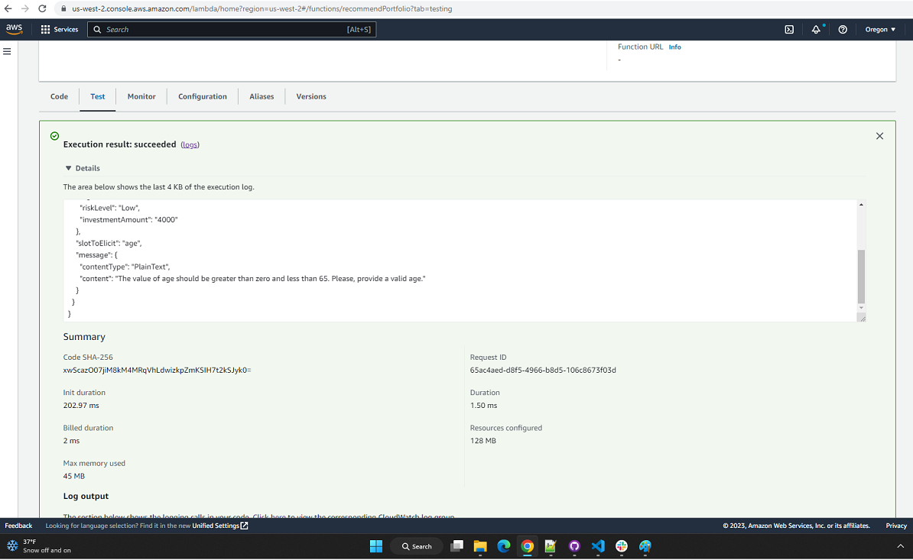
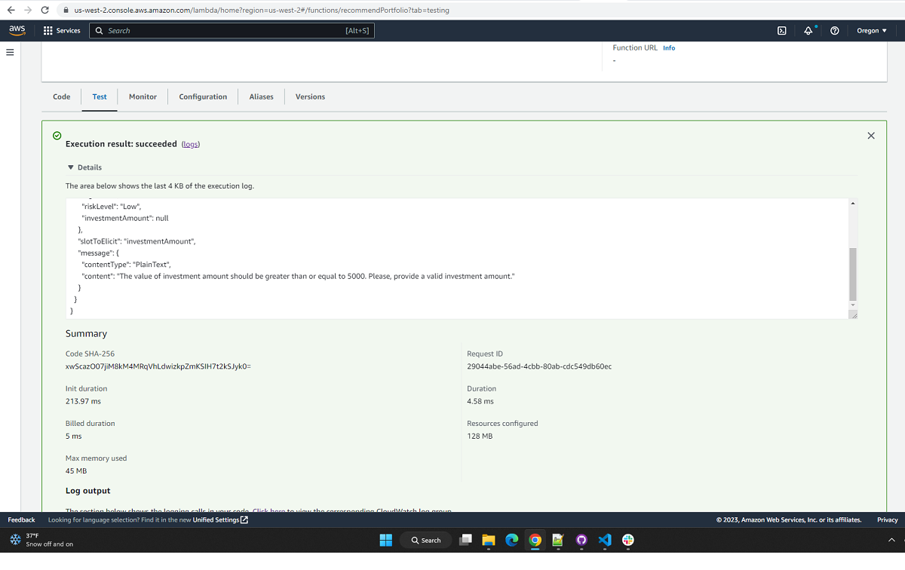

# Robo Advisor

Robo Advisor is an automated chatbot developed using Amazon Lex services. The chatbot is further integrated with AWS Lambda function to validate against the user's inputs when interacting with Robo Advisor.

Robo Advisor like chatbot has been quite popular in the recent years in most of the FinTech firms like SoFi, wealthfront, Vanguard, etc. Traditional banks also have its implementation, the popular being Erica robo advisor provided by Bank of America. The chatbots are often cited as low cost financial service and hence offer low portfolio management fees and provide a range of services, including tax strategies, access to human advisors and a variety of portfolio options.

### **Program Overview**
You’ve been hired as a digital transformation consultant by one of the most prominent retirement plan providers in the country. They want to increase their client portfolio—especially by engaging young people. Because machine learning and NLP are disrupting finance to improve the customer experience, you decide to create a robo advisor. Both existing and potentially new customers will be able to use this robo advisor to get investment portfolio recommendations for retirement.

The chatbot is developed with the following key implementations:
* Configure the initial robo advisor: Define an Amazon Lex bot with a single intent that establishes a conversation about requirements to suggest an investment portfolio for retirement.
* Build and test the robo advisor: Make sure that your bot works and accurately responds during the conversation with the user.
* Enhance the robo advisor with an Amazon Lambda function: Create an Amazon Lambda function that validates the user's input and returns the investment portfolio recommendation. This includes testing the Amazon Lambda function and integrating it with the bot.

---

## Technologies

This project leverages python 3.7.* with the following additional packages:
* [Amazon Lex](https://aws.amazon.com/lex/) - Amazon Lex is a fully managed artificial intelligence (AI) service with advanced natural language models to design, build, test, and deploy conversational interfaces in applications.
* [AWS lambda](https://aws.amazon.com/lambda/) - AWS Lambda is a serverless, event-driven compute service that lets you run code for virtually any type of application or backend service without provisioning or managing servers.

**Required Libraries:**

You may need the following library to work with the program.

- [botocore](https://botocore.amazonaws.com/v1/documentation/api/latest/index.html) - Botocore serves as the foundation for the AWS-CLI command line utilities and AWS services.

---

## Usage

To use the Robo Advisor, you may need to have an AWS user account with free-tier subscription, at least. Further, clone the repository to get *Lambda/lambda_function.py* used in AWS Lambda function. The 'Recordings' folder contains recordings of tesing Robo Advisor. The 'Test_Events' folder has sample test jsons to test validation rules implemented in *lambda_function.py*, which can be used to test AWS Lambda function from the AWS console.

You may need to develop and test Robo Advisor all in AWS console only.

## Robo Advisor Test Recordings

Follow the paths to view the test recordings.

*Ref*: Recordings/robo_advisor_lex/lex_test_recording.mp4 - Testing of Robo Advisor with just Amazon Lex

*Ref*: Recordings/robo_advisor_lex_lambda/lambda_lex_test_recording.mp4 - Testing of Robo Advisor with Amazon Lex and AWS Lambda function

## Unit Testing of AWS Lambda Function

|Scenario: Invalid Age|   |Scenario: Insufficient Amount|
|:-:|:-:|:-:|
| || |

***Note***: Robo Advisor is implemented in Amazon Lex V1 console. Hence, it is compatible with Lex V1 console only.

---

## Contributors

FinTech Labs, Inc.

---

## License

None
